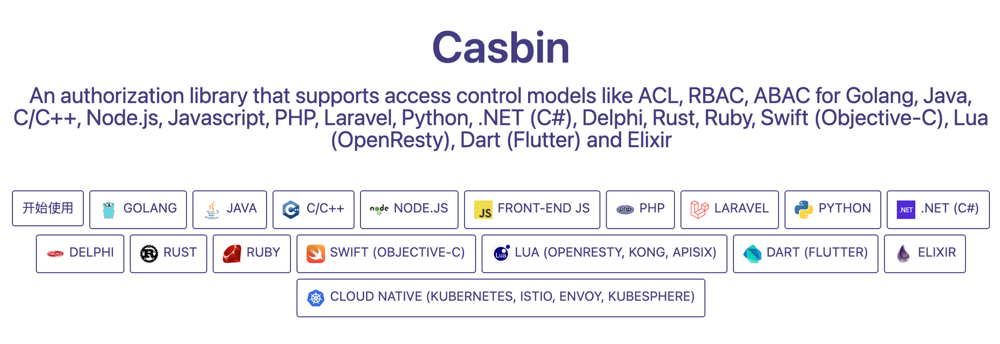

# Go语言 casbin 系列教程

稍微大一点的项目就一定会涉及到权限管理，
这个系列我们给大家介绍一个非常好用的鉴权库 casbin。



它是一个跨平台的库，支持很多种语言的鉴权。

官方文档： [https://casbin.org/docs/zh-CN/overview](https://casbin.org/docs/zh-CN/overview)

光讲解这个库的 API 很显然是枯燥的，所以我会结合 Gin，模拟实际开发中的鉴权去给大家讲解他的使用。

所以我们的工程里面会用到到的库如下：

```bash
go get github.com/casbin/casbin/v2
go get -u github.com/gin-gonic/gin
```

## 这个系列你能学到什么？

我在出这个系列文章的时候，最先考虑的就是这个问题，所以我给下列的答案：

- 我们的文章是围绕 RBAC 权限管理开展的，所以如果你要学习 ABAC, ACL 这类的，将不能满足你的需求。
- 你能很清楚的理解 casbin 的配置文件
- 你能比较熟悉 casbin 库的常用API
- 你将拥有能把 casbin 整合到 gin 工程里面
- 你能掌握基于 mysql 来控制你的权限
- ...

## 我们的官方公众号


## 系列文章链接

- [快速入门](https://mp.weixin.qq.com/s/wGEPuXgHS013mAyjD-ityA)